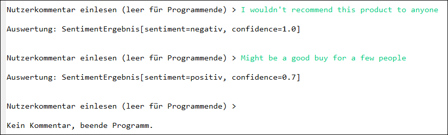

# Sentimentanalyse mit über REST-API angebundener KI #

 

Das Repo enthält eine mit Java programmierte Spring-Boot-Anwendung, die über die Konsole
eine Nutzerbewertung (z.B. für ein Produkt in einem Online-Shop) einliest und diesen
Text dann per REST-API an eine LLM-KI schickt.

 

AI-Model in [Docker Model Runner](https://docs.docker.com/ai/model-runner/):
[mistral:7B-Q4_0](https://hub.docker.com/layers/ai/mistral/7B-Q4_0/)

 

 

----

## License ##

 

See the [LICENSE file](LICENSE.md) for license rights and limitations (BSD 3-Clause License).

 
